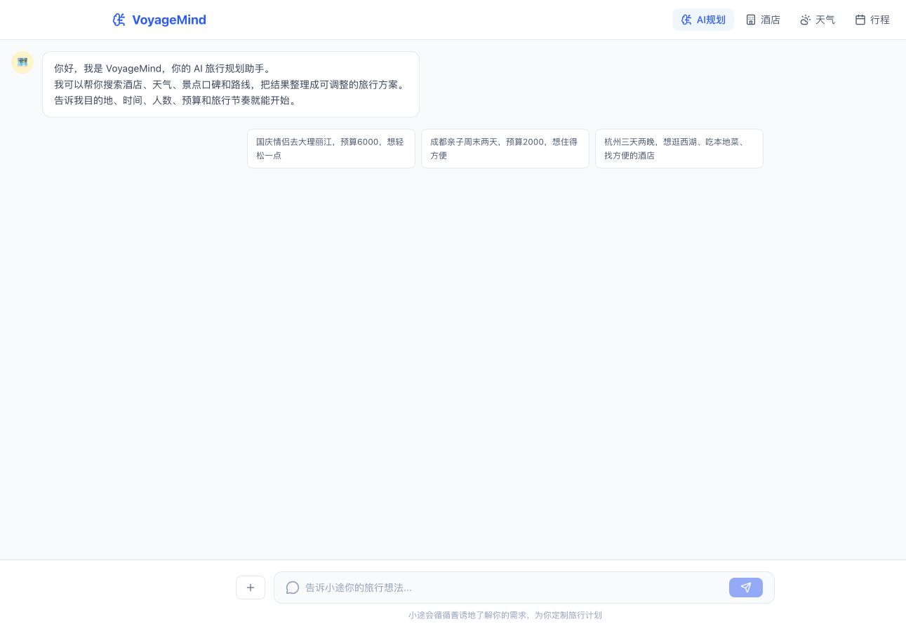

<h1 align="center">VoyageMind</h1>

<p align="center">
  面向真实旅行规划场景的工具调用型 AI 助手
  <br />
  Tool-calling AI travel planner for hotels, weather, POI discovery, community reviews, and itineraries.
</p>

<p align="center">
  
  
  
  
</p>

<p align="center">
  
</p>

VoyageMind 是一个面向真实旅行规划场景的 AI 助手原型。它不把模型记忆当作事实来源，而是通过工具调用获取酒店、天气、POI、路线和社区口碑数据，再把结果组织成可调整的旅行建议。

## 项目亮点

- 流式聊天界面，用于逐步收集目的地、预算、同行人和旅行节奏
- 支持 OpenAI-compatible LLM，不绑定某一家模型厂商
- 通过工具调用接入酒店、天气、景点、美食、路线和社区口碑
- 酒店结果结构化解析，过滤异常低价和无效评分
- 支持城市天气查询、酒店搜索和行程编辑
- 会话日志和需求 Markdown 快照，便于分析 Agent 行为
- 移动端友好，支持快捷问题和停止生成

## 需要准备的 Key

项目抽象为四类凭证：LLM、高德 AMap、美团 Meituan、知乎 Zhihu。

| 类别 | 环境变量 | 用途 | 申请入口 |
| --- | --- | --- | --- |
| LLM | `LLM_API_KEY` | OpenAI-compatible 聊天模型 | 使用你自己的模型服务商 |
| 高德 AMap | `AMAP_MAPS_API_KEY` / `NEXT_PUBLIC_AMAP_MAPS_API_KEY` | 地理编码、POI、天气、路线、静态地图 | [高德 Web 服务 Key 文档](https://lbs.amap.com/api/webservice/create-project-and-key) |
| 美团 Meituan | `MEITUAN_TRAVEL_TOKEN` 或本地配置 | 酒店搜索 | [美团技术服务合作中心](https://developer.meituan.com/ai-hub/mcp-list) / [美团生态开放平台](https://openapi.meituan.com/) |
| 知乎 Zhihu | `ZHIHU_API_KEY` | 社区口碑、攻略和避坑搜索 | [知乎开发者 API](https://developer.zhihu.com/) |

LLM 可选配置：

```bash
LLM_BASE_URL=https://your-llm-provider.example/v1
LLM_MODEL=your-model-name
```

只要服务兼容 OpenAI `/chat/completions` 接口，就可以替换为其他模型服务。

## 本地运行

```bash
npm install
cp .env.example .env.local
npm run dev
```

打开 [http://localhost:3000](http://localhost:3000)。

## 环境变量示例

```bash
LLM_API_KEY=
LLM_BASE_URL=
LLM_MODEL=

AMAP_MAPS_API_KEY=
NEXT_PUBLIC_AMAP_MAPS_API_KEY=
ZHIHU_API_KEY=
MEITUAN_TRAVEL_TOKEN=
```

美团 Token 也可以放在本地配置文件中：

```bash
~/.config/meituan-travel/config.json
```

```json
{
  "key": "your_meituan_token"
}
```

## 质量检查

```bash
npm run lint
npm run typecheck
npm run build
```

或一次性运行：

```bash
npm run check
```

## 项目结构

```text
app/
  api/                  Chat、酒店、高德工具 API routes
  hotels/               酒店搜索与详情页
  itinerary/            可编辑行程页
  weather/              天气查询页
components/
  chat/                 聊天 Markdown 渲染
  hotels/               酒店卡片与对比表
  layout/               导航
lib/
  agent.ts              Agent 主循环与工具编排
  amap-api.ts           高德 Web 服务封装
  city-presets.ts       城市地理预设
  meituan-cli.ts        美团酒店搜索客户端
  meituan-parser.ts     酒店 Markdown 解析器
  zhihu-api.ts          知乎搜索封装
types/                  共享 TypeScript 类型
```

<details>
<summary>English</summary>

## What Is VoyageMind?

VoyageMind is an AI travel planning prototype built around real-world planning workflows. Instead of treating model memory as a factual source, it uses tool calls to fetch hotel, weather, POI, route, and community review data before generating travel suggestions.

## Highlights

- Streaming chat interface for collecting travel requirements
- OpenAI-compatible LLM integration
- Tool calling for hotels, weather, attractions, food, routes, and community reviews
- Hotel result parsing with abnormal price and invalid rating filtering
- City weather search, hotel search, and editable itinerary board
- Runtime logs and generated requirement snapshots for Agent debugging
- Mobile-friendly UI with quick prompts and stop-generation control

## Required Keys

VoyageMind expects four credential categories: LLM, AMap, Meituan, and Zhihu.

| Category | Environment variable | Purpose | Apply |
| --- | --- | --- | --- |
| LLM | `LLM_API_KEY` | OpenAI-compatible chat completion model | Use your own LLM provider |
| AMap | `AMAP_MAPS_API_KEY` / `NEXT_PUBLIC_AMAP_MAPS_API_KEY` | geocoding, POI, weather, routes, static map | [AMap Web Service Key](https://lbs.amap.com/api/webservice/create-project-and-key) |
| Meituan | `MEITUAN_TRAVEL_TOKEN` or local config | hotel search | [Meituan Developer Center](https://developer.meituan.com/ai-hub/mcp-list) / [Meituan Open Platform](https://openapi.meituan.com/) |
| Zhihu | `ZHIHU_API_KEY` | community reviews and travel guide search | [Zhihu Developer API](https://developer.zhihu.com/) |

Optional LLM settings:

```bash
LLM_BASE_URL=https://your-llm-provider.example/v1
LLM_MODEL=your-model-name
```

Any provider that exposes an OpenAI-compatible `/chat/completions` endpoint can be used.

## Getting Started

```bash
npm install
cp .env.example .env.local
npm run dev
```

Open [http://localhost:3000](http://localhost:3000).

## Quality Checks

```bash
npm run lint
npm run typecheck
npm run build
```

Or run all checks:

```bash
npm run check
```

</details>

## License

MIT
